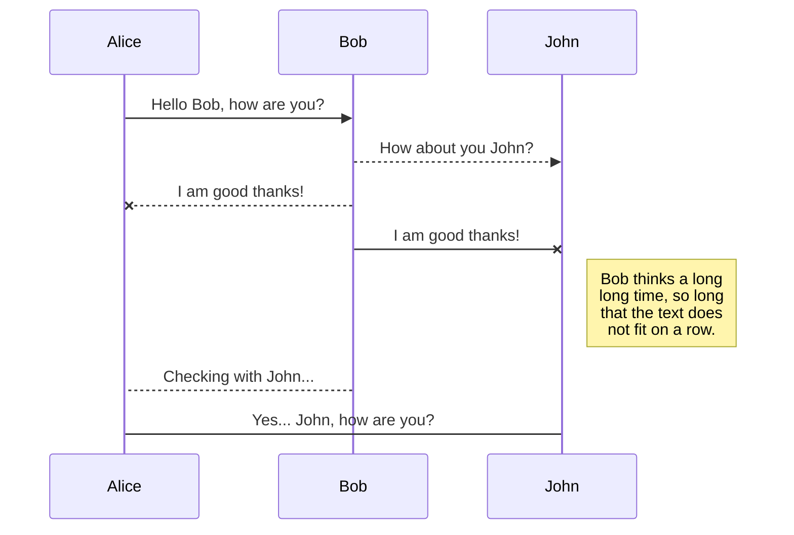
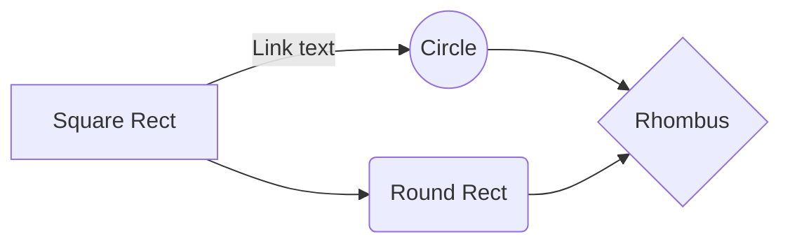

# DevArno 🧑‍💻

My portfolio website

### CLI

A few basic custom package.json scripts to make development easier

-   Run application locally on PORT 3000 (http://localhost:3000):
    _Note: Run on a different port with `yarn next -p PORTNUMBER`._

```sh
yarn go
```

-   Open Cypress integration testing suite:

```sh
yarn cy
```

-   Check code is production-ready (lint + build):

```sh
yarn test
```

-   Prepare and commit a build for deployment:
    _Note: You will be prompted for a commit message. This will fail if left empty. Defaults to string, no "" marks necessary._

```sh
yarn prep
```

-   Push latest commit to a branch:
    _Note: You will be prompted for a branch name. This will fail if you enter 'main' or leave empty. Defaults to string, no "" marks necessary._

```sh
yarn push
```

-   List your local git branches:

```sh
yarn l
```

-   List your remote git branches:

```sh
yarn r
```

-   Delete a local git branch:

```sh
yarn dl BRANCHNAME
```

-   Delete a remote git branch:

```sh
yarn dr BRANCHNAME
```

-   Kill port 3000 (when you receive `Port 3000 is in use, trying 3001 instead.`):

```sh
yarn kill
```

## SmartyPants

SmartyPants converts ASCII punctuation characters into "smart" typographic punctuation HTML entities. For example:

|                  | ASCII                           | HTML                          |
| ---------------- | ------------------------------- | ----------------------------- |
| Single backticks | `'Isn't this fun?'`             | 'Isn't this fun?'             |
| Quotes           | `"Isn't this fun?"`             | "Isn't this fun?"             |
| Dashes           | `-- is en-dash, --- is em-dash` | -- is en-dash, --- is em-dash |

## KaTeX

You can render LaTeX mathematical expressions using [KaTeX](https://khan.github.io/KaTeX/):

The _Gamma function_ satisfying $\Gamma(n) = (n-1)!\quad\forall n\in\mathbb N$ is via the Euler integral

$$
\Gamma(z) = \int_0^\infty t^{z-1}e^{-t}dt\,.
$$

> You can find more information about **LaTeX** mathematical expressions [here](http://meta.math.stackexchange.com/questions/5020/mathjax-basic-tutorial-and-quick-reference).

## UML diagrams

You can render UML diagrams using [Mermaid](https://mermaidjs.github.io/). For example, this will produce a sequence diagram:



And this will produce a flow chart:


